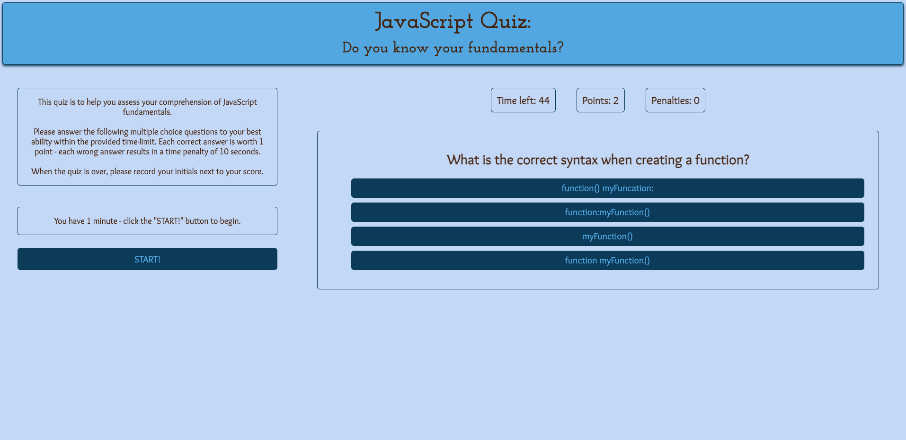

# JavaScript_Fundamentals-_Quiz

## Creating a quiz about JavaScript Basics using JavaScript

The quiz was built from scratch with HTML, CSS, and JavaScript. The focus is to use JavaScript in order to implement user interactions and move the quiz forward. 

* **D**ocument **O**bject **M**odal:

Otherwise known as **DOM**, it allows access and manipulation of HTML. 

* Web Storage API:

The two mechanisms `sessionStorage` and `localStorage` can be used by browsers to store data. `localStorage` is used in this assignment to store user stats (ie. points, initals) in order to present them in a "Highscores" page.

## Project Status

This project still has the following bugs to work out:

1. console error `mergedStats.push is not a function`
2. last question in array is difficult for user to answer - if any choice is clicked on > console error `Cannot read property 'quest' of undefined.`

## Installation

1. Clone this repository onto local workspace
2. Open Terminal (MacOS) or Git Bash (Windows) and change location to where you want the cloned directory
3. Type `git clone` and paste copied respository
4. Directory should include the following:
    * `index.html`
    * `highscores.html`
    * assets folder:
        * css folder
            * `style.css`
            * `highscores.css`
        * JavaScript folder
            * `script.js`
            * `highscores.js`
        * images folder
    * `README.md`

## Screenshot

## Deployment
*Note: please refer back to* "Project Status" *section for specifics.*

Please use the following link to deploy live URL of this project:

[JavaScript Fundamentals Quiz](https://p-hsu.github.io/JavaScript_Fundamentals_Quiz/)

## Credit

* Class instructor provided assistance in debugging some sections of JavaScript code, as commented. 
